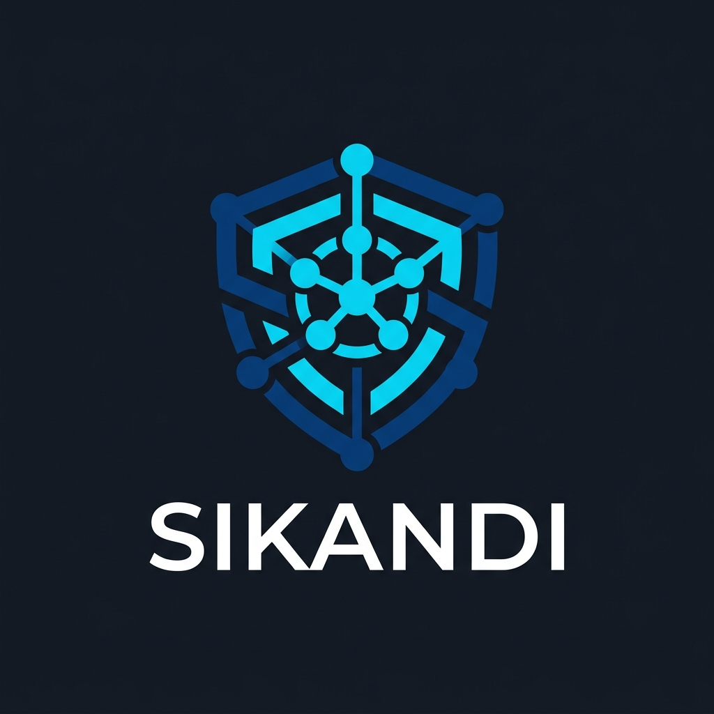
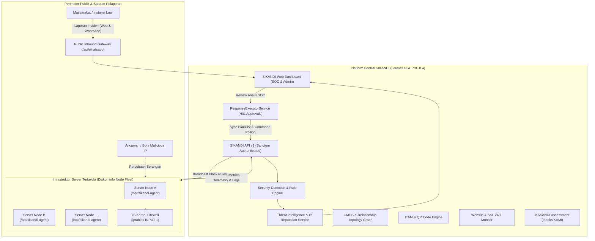

<p align="center">
  
</p>

<h1 align="center">SIKANDI</h1>

<p align="center">
  <strong>Sistem Informasi Keamanan Informasi & Tata Kelola Sandi</strong><br>
  <em>Integrated Cyber Security Operations Center (SOC), IT Asset Management (ITAM), Configuration Management Database (CMDB), and Automated Incident Response Platform</em>
</p>

<p align="center">
  <strong>Dinas Komunikasi dan Informatika Kabupaten Ciamis — CSIRT Ciamis</strong>
</p>

<p align="center">
  <a href="https://php.net"></a>
  <a href="https://laravel.com"></a>
  <a href="https://tailwindcss.com"></a>
  <a href="#"></a>
  <a href="#"></a>
  <a href="STANDAR_KEPATUHAN_ISO.md"></a>
  <a href="LICENSE"></a>
</p>

---

## 📌 Ringkasan Eksekutif

**SIKANDI** (*Sistem Informasi Keamanan Informasi & Tata Kelola Sandi*) adalah platform pertahanan siber dan tata kelola teknologi informasi terintegrasi (*Single Gateway Platform*) yang dikembangkan untuk mengonsolidasikan pemantauan aset, mitigasi ancaman siber, dan manajemen layanan TI di lingkungan Pemerintah Daerah Kabupaten Ciamis.

SIKANDI menjembatani kebutuhan administratif tata kelola TI dengan kesiapsiagaan operasional tim **CSIRT (*Computer Security Incident Response Team*)** melalui integrasi langsung ke agent keamanan di tingkat sistem operasi server (*host-level security agents*), deteksi anomali berbasis kecerdasan ancaman terdistribusi, serta alur persetujuan respons insiden berbasis *Human-in-the-Loop* (HitL).

---

## 🛡️ Filosofi Arsitektur & Keamanan (Zero Trust)

SIKANDI dibangun berlandaskan prinsip **Zero Trust Architecture** dan pertahanan adaptif:

1. **Global Threat Intelligence & Network-Wide Blocking**:
   Ketika salah satu node/agent mendeteksi serangan atau entitas IP berbahaya dan disetujui oleh analis SOC, platform sentral secara otomatis menyiarkan perintah pemblokiran (*global blacklist*) ke **seluruh agent server** yang terhubung.
2. **OS-Layer Firewall Enforcement**:
   Setiap agent keamanan ([SIKANDI-Agent](https://github.com/lhermawan/SIKANDI-Agent)) mengeksekusi penahanan ancaman langsung pada lapisan kernel sistem operasi melalui `iptables` (`iptables -I INPUT 1 -s <IP> -j DROP`). Paket jahat dibuang sebelum mencapai *reverse proxy* (Nginx/OpenLiteSpeed), *runtime container*, maupun aplikasi web.
3. **Idempotency & Fail-Safe Execution**:
   Seluruh interaksi firewall memverifikasi keberadaan aturan terlebih dahulu (`iptables -C`) guna mencegah duplikasi entri serta menjamin kestabilan jaringan host.
4. **Human-in-the-Loop (HitL) SOC Workflow**:
   Tindakan tanggap darurat yang dihasilkan oleh mesin deteksi berstatus *Pending Approval*. Analis SOC memiliki kendali penuh untuk meninjau bukti forensik digital sebelum mengeksekusi aksi mitigasi (*Single* maupun *Bulk Execution*).

---

## 🏛️ Diagram Arsitektur Sistem



---

## ✨ Fitur Utama & Modul Sistem

### 1. 🚨 Security Operations Center (SOC) & Manajemen Insiden CSIRT
- **Triage Insiden Standar ISO/IEC 27035**: Siklus penanganan 6 tahap (*Persiapan, Identifikasi, Penahanan, Pembasmian, Pemulihan, Pasca-Insiden*).
- **Forensik & Evidence Lockbox**: Penyimpanan bukti digital terenkripsi dilengkapi *tamper-evident checksum* untuk menjaga integritas investigasi.
- **Automated Response Tasks**: Pembuatan otomatis task penahanan insiden dengan opsi eksekusi mandiri maupun massal (*Bulk Execution*).
- **Public & WhatsApp Incident Inbound**: Pelaporan insiden siber langsung via portal publik atau webhook WhatsApp, lengkap dengan pelacakan nomor tiket.

### 2. 🌐 Global Threat Intelligence & Manajemen Threat Actors
- **Pelacakan Reputasi IP**: Scoring risiko berbasis frekuensi serangan, anomali payload, dan riwayat aktivitas mencurigakan.
- **Pusat Persetujuan SOC (SOC Approvals)**: Konsol terpusat bagi analis untuk menyetujui, menolak, atau menangguhkan draf respons mitigasi.
- **Global Firewall Blacklist & Whitelist**: Mekanisme sinkronisasi daftar cekal IP terpusat ke seluruh node server di bawah naungan Diskominfo.

### 3. 🤖 Integrasi SIKANDI Endpoint Agent
- **Koneksi Telemetri Real-Time**: Monitoring utilisasi CPU, RAM, Disk, serta status service Linux (`systemd`).
- **Remote Disk Management**: Pemindaian penggunaan ruang penyimpanan server jarak jauh dan orkestrasi pembersihan log/cache usang secara terkendali.
- **Command Dispatcher**: Pengiriman instruksi terisolasi ke agent dengan autentikasi berbasis Sanctum Token.

### 4. 🗺️ CMDB (Configuration Management Database) & Peta Relasi
- **Inventarisasi Configuration Items (CI)**: Pencatatan menyeluruh server fisik, virtual machine, database, web application, dan perangkat jaringan.
- **Visual Node Relationship Graph**: Representasi visual topologi dependensi antar komponen TI untuk mempermudah analisis dampak kegagalan (*Blast Radius Analysis*).

### 5. 🏷️ IT Asset Management (ITAM)
- **Lifecycle Tracking**: Pengelolaan aset fisik dari pengadaan, penempatan ruang/OPD, pemeliharaan, hingga disposisi (penghapusan).
- **Smart QR Code Generator**: Pembuatan label fisik aset terintegrasi dengan portal verifikasi mobile scan publik (`/itam/scan/{token}`).

### 6. 📊 Monitoring Website Pemda & Validitas SSL
- **Pemeriksaan Berkala Uptime**: Deteksi dini downtime portal dan subdomain instansi pemerintah daerah.
- **Peringatan Kedaluwarsa SSL**: Pemantauan masa aktif sertifikat TLS/SSL secara otomatis guna mencegah risiko sertifikat kedaluwarsa.
- **Anti-Defacement Detection**: Deteksi dini perubahan halaman beranda situs melalui analisis respon status HTTP dan konten.

### 7. 📋 Asesmen IKASANDI (Indikator Keamanan Informasi OPD)
- **Evaluasi Mandiri Keamanan Informasi**: Framework asesmen kepatuhan keamanan informasi selaras dengan standar Indeks KAMI BSSN.
- **Skor & Rekomendasi Terstruktur**: Perhitungan skor kematangan tata kelola keamanan informasi di tingkat Organisasi Perangkat Daerah (OPD) beserta pelaporan siap cetak.

### 8. 🎫 IT Service Desk & Ticketing
- **Katalog Layanan Terpadu**: Pengajuan dan penanganan tiket permohonan layanan teknologi informasi dan persandian.
- **Penetapan SLA & Eskalasi**: Pemantauan waktu tanggap (*response time*) dan penyelesaian masalah (*resolution time*).

### 9. 🔐 Keamanan & Kontrol Akses Terkelola
- **Two-Factor Authentication (2FA TOTP)**: Verifikasi ganda menggunakan aplikasi authenticator standar industri (Google Authenticator, Microsoft Authenticator).
- **Proteksi Brute-Force & Lockout**: Pembatasan laju percobaan masuk (*Rate Limiting*) dan penguncian akun otomatis saat mendeteksi anomali autentikasi.
- **Role-Based Access Control (RBAC)**: Pembatasan hak akses bertingkat menggunakan Spatie Permission (*Super Admin, Admin Persandian, IT Technician, Management, OPD User*).
- **Tamper-Evident Audit Logging**: Pencatatan riwayat audit lengkap pada setiap operasi data sensitif melalui *audit trail*.

---

## 📜 Kepatuhan Standar Internasional (ISO)

Platform SIKANDI telah dirancang memenuhi dan mendukung implementasi berbagai standar tata kelola internasional:

| Standar ISO | Ruang Lingkup & Fokus | Implementasi di SIKANDI |
| :--- | :--- | :--- |
| **ISO/IEC 27001** | Sistem Manajemen Keamanan Informasi (SMKI / ISMS) | Risk Register, IKASANDI, 2FA TOTP, Audit Trail, Agent Telemetry |
| **ISO/IEC 20000-1** | Manajemen Layanan TI (ITSM / Service Management) | IT Service Desk, Penegakan SLA, CMDB & Relasi Konfigurasi |
| **ISO/IEC 27035** | Manajemen Insiden Keamanan Informasi (CSIRT/SOC) | Alur 6 Tahap Penanganan Insiden, Forensik, Automasi Respon |
| **ISO/IEC 19770-1** | Manajemen Aset TI (ITAM) | Manajemen Siklus Hidup Aset TI, Pelabelan QR Code Aset |
| **ISO 31000 / 27005**| Manajemen Risiko Keamanan Informasi | Matriks Heatmap Risiko 5x5, Rencana Penanganan Risiko (*Risk Treatment*) |
| **ISO 22301** | Kelangsungan Layanan & Pemulihan Bencana (BCMS) | Verifikasi Jadwal Backup/Restore Drill, Pemantauan Uptime 24/7 |
| **ISO 9001** | Tata Kelola Informasi Terdokumentasi (Klausul 7.5) | Knowledge Base, Manajemen Dokumen Kebijakan & SOP Berversi |

> Detail pemetaan teknis lengkap dapat dibaca pada [STANDAR_KEPATUHAN_ISO.md](STANDAR_KEPATUHAN_ISO.md).

---

## 💻 Spesifikasi Teknologi

| Komponen | Teknologi |
| :--- | :--- |
| **Core Framework** | Laravel 13.x |
| **Bahasa Pemrograman** | PHP 8.4 (Strict Types, Constructor Promotion) |
| **Database** | SQLite (Default Dev) / MySQL 8.0+ / MariaDB 10.6+ |
| **Frontend Styling** | Tailwind CSS v4.0, Vite 8.0 |
| **Autentikasi & API** | Laravel Sanctum, Google2FA Laravel (`pragmarx/google2fa-laravel`) |
| **Otorisasi & RBAC** | Spatie Laravel Permission (`spatie/laravel-permission`) |
| **Pelabelan & QR Code**| Simple Software IO Simple QrCode (`simplesoftwareio/simple-qrcode`) |
| **Ekspor/Impor Data** | Maatwebsite Excel 4.0 (`maatwebsite/excel`) |
| **Endpoint Agent** | Python 3 Daemon ([SIKANDI-Agent](https://github.com/lhermawan/SIKANDI-Agent)), Linux Systemd, `iptables` |

---

## 🚀 Panduan Instalasi & Menjalankan Sistem

### Kebutuhan Sistem
- PHP >= 8.3 / 8.4 (dengan ekstensi: `pdo`, `mbstring`, `openssl`, `curl`, `gd`, `zip`, `sqlite3` atau `pdo_mysql`)
- Composer >= 2.x
- Node.js >= 20.x & npm
- Web Server: Nginx, Apache, atau cPanel/CloudLinux

### 1. Kloning Repositori
```bash
git clone https://github.com/lhermawan/SIKANDI.git
cd SIKANDI
```

### 2. Pemasangan Dependensi
```bash
# Dependensi PHP
composer install

# Dependensi Frontend
npm install
```

### 3. Konfigurasi Lingkungan (.env)
```bash
cp .env.example .env
php artisan key:generate
```

Sesuaikan parameter konfigurasi database pada `.env`:
```env
APP_NAME=SIKANDI
APP_ENV=production
APP_DEBUG=false
APP_URL=https://sikandi.ciamiskab.go.id

DB_CONNECTION=mysql
DB_HOST=127.0.0.1
DB_PORT=3306
DB_DATABASE=sikandi_db
DB_USERNAME=sikandi_user
DB_PASSWORD=secret_password
```

### 4. Migrasi & Seeding Basis Data
```bash
# Menjalankan migrasi struktur tabel
php artisan migrate

# Menjalankan seeder data awal (Roles, Permissions, Kategori CI, Soal IKASANDI)
php artisan db:seed
```

### 5. Kompilasi Aset Frontend
```bash
# Mode Produksi
npm run build

# Mode Pengembangan (Hot Reload)
npm run dev
```

### 6. Menjalankan Antrean (Queue) & Scheduler
Pastikan background worker berjalan untuk memproses pemantauan website dan sinkronisasi log:
```bash
# Menjalankan Queue Worker
php artisan queue:work --tries=3

# Mendaftarkan Scheduler di Cron Server (* * * * * cd /path/to/sikandi && php artisan schedule:run >> /dev/null 2>&1)
php artisan schedule:run
```

---

## 📡 Integrasi SIKANDI Endpoint Agent

SIKANDI Agent merupakan daemon independen berbasis Python yang dipasang pada setiap server target yang dipantau.

- **Repositori Agent**: [lhermawan/SIKANDI-Agent](https://github.com/lhermawan/SIKANDI-Agent)
- **Lokasi Pemasangan Standar**: `/opt/sikandi-agent`
- **Layanan Systemd**: `sikandi-agent.service`

### Alur Pendaftaran Node Agent:
1. Administrator membuat token pendaftaran baru di menu **Agents** pada dashboard SIKANDI.
2. Masukkan URL sentral dan token pada `config.yaml` di agent server.
3. Jalankan service `systemd`:
   ```bash
   sudo systemctl daemon-reload
   sudo systemctl enable --now sikandi-agent.service
   ```
4. Verifikasi dan berikan persetujuan (*Approve*) koneksi agent melalui Dashboard SIKANDI.

---

## 📂 Struktur Direktori Utama

```
SIKANDI/
├── app/
│   ├── Http/
│   │   ├── Controllers/
│   │   │   ├── Admin/             # Manajemen Pengguna, OPD, Audit Log, Lokasi
│   │   │   ├── Api/               # API V1 & Webhook WhatsApp Inbound
│   │   │   ├── DashboardController.php
│   │   │   ├── SecurityIncidentController.php
│   │   │   ├── MonitoringController.php
│   │   │   ├── CmdbController.php
│   │   │   └── ...
│   ├── Models/                    # Model Eloquent (Incident, Asset, CI, Agent, Risk, dll.)
│   ├── Services/                  # Business Logic Services
│   │   ├── ResponseExecutorService.php   # Eksekutor respons firewall & agent
│   │   ├── SecurityDetectionEngine.php   # Mesin analisa anomali & rules
│   │   ├── ThreatIntelService.php        # Intelijen reputasi IP
│   │   └── WebsiteMonitoringService.php  # Worker pemantau web & sertifikat SSL
│   └── Traits/
│       └── HasAuditLog.php        # Pencatatan riwayat audit otomatis
├── config/                        # Konfigurasi sistem
├── database/
│   ├── migrations/                # Skema tabel basis data
│   └── seeders/                   # Data benih (Role, Permission, Soal IKASANDI)
├── resources/
│   ├── css/                       # Gaya Tailwind CSS
│   └── views/                     # Template Blade (Admin, SOC, CMDB, ITAM, Monitoring)
├── routes/
│   ├── web.php                    # Rute portal dashboard web & otentikasi
│   ├── api.php                    # Rute REST API v1 untuk agent dan integrasi luar
│   └── console.php                # Perintah Artisan terjadwal
└── tests/                         # Suite pengujian unit dan fitur
```

---

## 🔒 Kebijakan Keamanan & Pelaporan Kerentanan

Keamanan sistem adalah prioritas tertinggi. Jika Anda menemukan indikasi kerentanan keamanan (*security vulnerability*) pada aplikasi SIKANDI:
- Mohon **JANGAN** membuat *issue* publik di GitHub.
- Laporkan temuan tersebut secara bertanggung jawab (*responsible disclosure*) kepada Tim **CSIRT Dinas Komunikasi dan Informatika Kabupaten Ciamis** melalui email resmi: `csirt@ciamiskab.go.id` atau saluran khusus tim persandian.

---

## 📄 Lisensi

Platform SIKANDI didistribusikan di bawah lisensi resmi **[MIT License](LICENSE)**.

---

<p align="center">
  <strong>Dikembangkan & Dikelola Oleh</strong><br>
  <strong>Bidang Persandian dan Keamanan Informasi</strong><br>
  Dinas Komunikasi dan Informatika Kabupaten Ciamis &copy; 2026. Hak Cipta Dilindungi.
</p>
